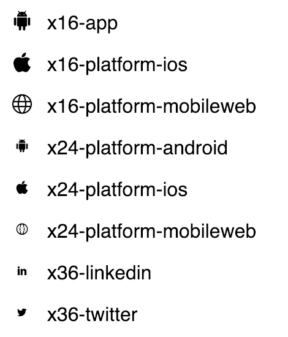

# webfonts-generator-cli
Command line client for webfonts-generator

A webfonts generator client that enables you to generate fonts from a set of SVG icons.

Broadly inspired by [dcs-icon-font](https://github.com/Exictos-DCS/dcs-icon-font)

[](https://codecov.io/gh/yopfull/webfonts-generator-cli)

## Installation

You can install it through NPM, simply run:

```
npm install webfonts-generator-cli --dev
```

Or using yarn

```
yarn add webfonts-generator-cli -D
```

Or you can clone it and install all its dependencies:
```
git clone https://github.com/yopfull/webfonts-generator-clit.git
cd webfonts-generator-cli
npm install
npm run build
```

## Usage

When installing from NPM globally, you can simply run:

```
webfonts-generator-cli --icons my-svg-icons/*.svg
```

See the "Options List" for more options.

## Preview

Will produce the following in your web browser:



## Options List

These are all the flags that you can use with the *webfonts-generator-cli* generator:

| Flag                        | Description
| -----------------------     |-------------
| --help                      | Presents all the available arguments that the webfonts-generator-cli cli is ready to handle
| --out [string]              | Specifies where the generated code is stored into. Default *"./build"*
| --icons [string]            | Specifies the directory that contains the SVG icons from which you want to generate the font. Default *"./icons/&#42;.svg"*
| --fontName [string]         | The name for your brand new font. Default *"wfgIconFont"*
| --baseSelector [string]     | Specifies the base CSS class name. Default *"wfg-icon"*
| --cssFontsUrl [string]      | Specifies the *font URL* to be defined into the resulting *CSS* file. Default: the *--fontname* specified
| --cssDest [string]          | Specifies destination path for the resulting *CSS* file. Default: The *--out* specified
| --classPrefix [string]       | Specifies the CSS class prefix for all your icons. Default *"wfg-icon-"*
| --html                      | Because it would be nice to have a preview of all the generated fonts and CSS, you can pass this flag and have a html file with a html preview
| --sass                      | You're a cool developer and you use Sass instead of CSS? Not a problem, just provide this flag and get a brand new **.scss** file
| --htmlTemplate [string]     | Hmmm.. Need to provide a different HTML for the font preview? Specify your own HTML template
| --cssTemplate [string]      | The CSS generated is not enough for what you need? Specify your custom CSS template
| --scssTemplate [string]     | Specify your Sass template to meet all your needs
| --fixedWidth [bool]          | Option passed directly to [svgicons2svgfont]
| --centerHorizontally [bool] | Option passed directly to [svgicons2svgfont]
| --normalize [bool]          | Option passed directly to [svgicons2svgfont]
| --descent [Number]          | Option passed directly to [svgicons2svgfont]
| --fontHeight [Number]       | Option passed directly to [svgicons2svgfont]
| --codepoints [string]       | Specify a custom codepoints json object to preserve or cucstomize icons hexa codes
| --types [string]            | list of type separated by a coma  Default *svg,ttf,woff,woff2,eot*

References:

* [svgicons2svgfont](https://github.com/nfroidure/svgicons2svgfont)
* [webfonts-generator](https://github.com/sunflowerdeath/webfonts-generator)
* [dcs-icon-font](https://github.com/Exictos-DCS/dcs-icon-font)
